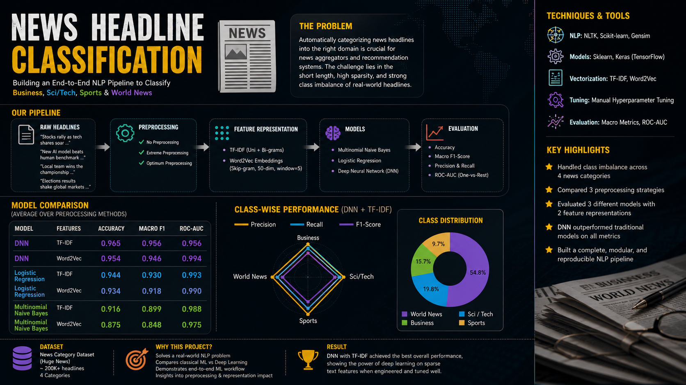
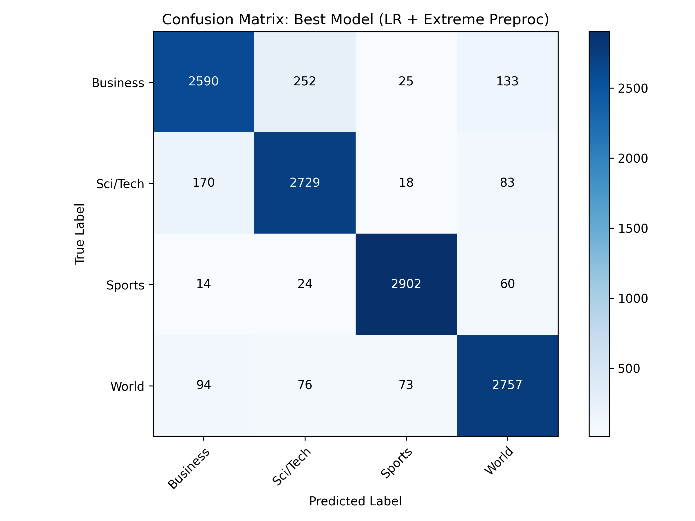
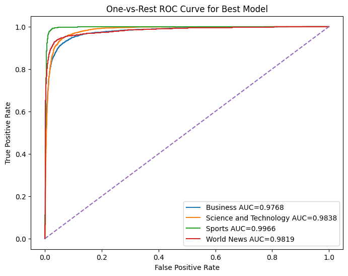
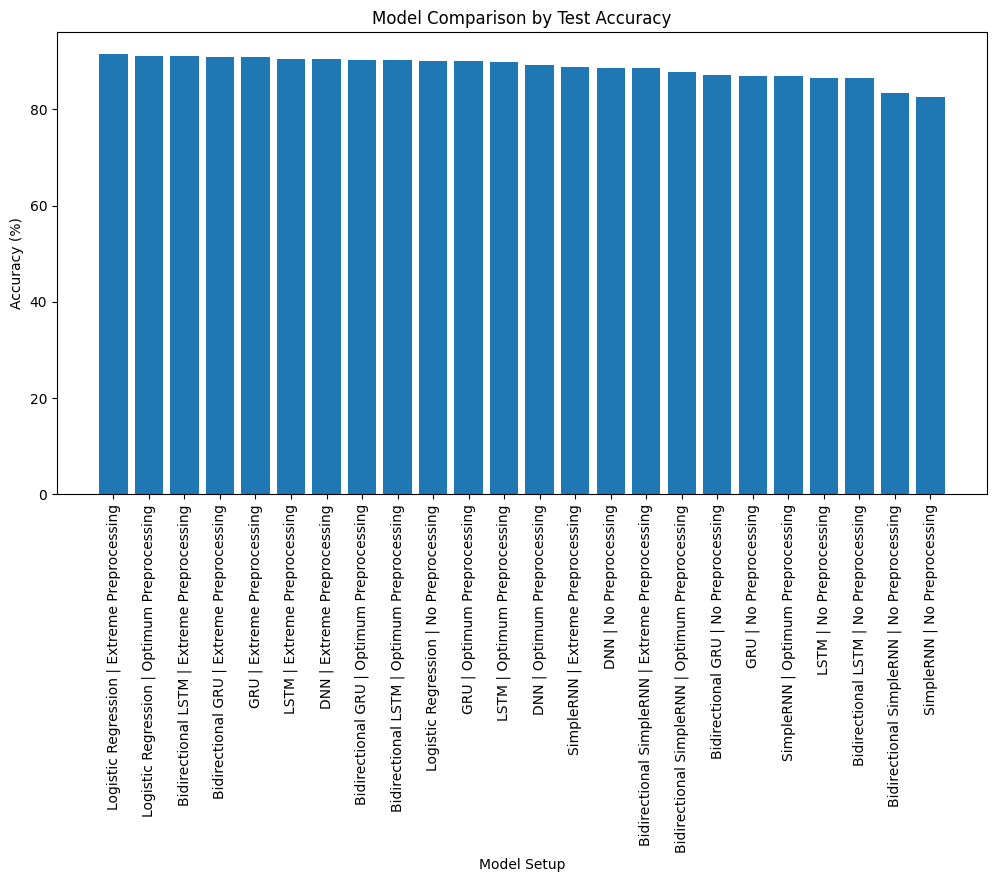

# 🧠 Multi-Class News Headline Classification

<div align="center">


### Comparative NLP Pipeline using TF-IDF, Skip-gram, DNN, RNN, GRU, LSTM & BiLSTM

<p align="center">
  
</p>

</div>

---

# 📌 Overview

This project presents a complete end-to-end **Natural Language Processing (NLP)** pipeline for multi-class news headline classification.

The system classifies news headlines into four categories:

* 🌍 World News
* 💼 Business
* 🧪 Science & Technology
* ⚽ Sports

Instead of relying on a single model, this project performs a full comparative analysis across:

* Multiple preprocessing strategies
* TF-IDF and Skip-gram word representations
* Classical ML models
* Deep Neural Networks
* Sequential RNN architectures

The project was designed following strict academic constraints while maintaining industry-standard experimentation and evaluation workflows.

---

# 🚀 Key Features

## 🔍 Extensive Exploratory Data Analysis (EDA)

* Class distribution analysis
* Text length distribution
* Word frequency analysis
* Word clouds
* Noise inspection (HTML, URLs, punctuation)
* Cleaned vs raw text comparison

## 🧹 Three Preprocessing Pipelines

* No Preprocessing
* Extreme Preprocessing
* Optimum Preprocessing

## 🧠 Multiple Word Representation Techniques

* TF-IDF (Unigram + Bigram)
* Skip-gram Word2Vec

## 🤖 Machine Learning & Deep Learning Models

### Classical ML

* Logistic Regression

### Deep Learning

* Deep Neural Network (DNN)
* SimpleRNN
* GRU
* LSTM
* Bidirectional SimpleRNN
* Bidirectional GRU
* Bidirectional LSTM

## 📊 Advanced Evaluation Metrics

* Accuracy
* Macro F1-score
* Precision
* Recall
* Confusion Matrix
* ROC Curve
* ROC-AUC Score
* Classification Report

## ⚙️ Hyperparameter Tuning

* Validation-loss-based model selection
* Multiple tuning experiments
* Overfitting analysis
* Model comparison framework

---

# 🏗️ Project Pipeline

```text
Dataset Loading
      ↓
Raw EDA
      ↓
Train / Validation / Test Split
      ↓
Three Preprocessing Pipelines
      ↓
TF-IDF & Skip-gram Embeddings
      ↓
ML + Deep Learning Models
      ↓
Hyperparameter Tuning
      ↓
Evaluation & Comparison
      ↓
Best Model Selection
```

---

# 📂 Dataset

## Dataset Source

Kaggle Dataset:

🔗 [https://www.kaggle.com/datasets/shafin11027/newspaper-headline-tag](https://www.kaggle.com/datasets/shafin11027/newspaper-headline-tag)

## Dataset Classes

| Class                | Description                               |
| -------------------- | ----------------------------------------- |
| World News           | International political and global events |
| Business             | Economy, market, company, finance news    |
| Science & Technology | Technology, innovation, software, science |
| Sports               | Sports matches, tournaments, players      |

---

# 📊 Dataset Statistics

## Train / Validation / Test Split

| Dataset    | Samples |
| ---------- | ------: |
| Train      |  56,504 |
| Validation |  14,127 |
| Test       |  12,000 |

## Class Distribution

| Class                |  Train |
| -------------------- | -----: |
| World News           | 17,376 |
| Science & Technology | 16,103 |
| Business             | 12,060 |
| Sports               | 10,965 |

---

# 🧹 Preprocessing Strategies

## 1️⃣ No Preprocessing

Raw headlines are directly used.

### Purpose

Used as a baseline to compare the impact of text cleaning.

---

## 2️⃣ Extreme Preprocessing

Includes:

* Lowercasing
* HTML removal
* URL removal
* Punctuation removal
* Stopword removal
* Stemming
* Whitespace normalization

### Purpose

Aggressively cleans noisy text for maximum normalization.

---

## 3️⃣ Optimum Preprocessing

Includes:

* Lowercasing
* HTML removal
* URL removal
* Basic normalization

### Purpose

Balances cleaning and semantic preservation.

---

# 🧠 Word Representation Techniques

## TF-IDF

Used for:

* Logistic Regression
* Deep Neural Network (DNN)

### Configuration

```python
TfidfVectorizer(
    max_features=12000,
    ngram_range=(1, 2)
)
```

### Why TF-IDF?

TF-IDF gives higher importance to discriminative words while reducing the impact of extremely common words.

---

## Skip-gram Word2Vec

Used for:

* RNN
* GRU
* LSTM
* Bidirectional variants

### Configuration

```python
Word2Vec(
    vector_size=50,
    window=5,
    min_count=1,
    sg=1
)
```

### Why Skip-gram?

Skip-gram performs well for learning semantic representations, especially for rare words.

---

# 🤖 Model Architectures

# Logistic Regression

### Feature Input

* TF-IDF vectors

### Hyperparameter

* Regularization parameter `C`

### Why Logistic Regression?

Logistic Regression performs strongly on sparse high-dimensional text features.

---

# Deep Neural Network (DNN)

## Architecture

```text
Input Layer
    ↓
Dense Layer (ReLU)
    ↓
Dropout
    ↓
Dense Layer (ReLU)
    ↓
Dropout
    ↓
Dense Layer (ReLU)
    ↓
Output Layer (Softmax)
```

## Features

* Multiple hidden layers
* ReLU activation
* Dropout regularization
* Softmax multi-class prediction

---

# RNN-Based Models

Implemented:

* SimpleRNN
* GRU
* LSTM
* Bidirectional SimpleRNN
* Bidirectional GRU
* Bidirectional LSTM

## Shared Components

* Skip-gram embedding matrix
* Sequence padding
* Softmax output layer
* Sparse categorical cross-entropy loss

---

# 📈 Model Evaluation

## Metrics Used

| Metric           | Purpose                                    |
| ---------------- | ------------------------------------------ |
| Accuracy         | Overall prediction correctness             |
| Macro F1-score   | Balanced evaluation for imbalanced classes |
| Precision        | Prediction quality                         |
| Recall           | Coverage of actual class                   |
| ROC-AUC          | Probability separability                   |
| Confusion Matrix | Error analysis                             |

---

# 🧪 Hyperparameter Tuning

The project performs manual tuning experiments for:

* Hidden units
* Dropout rate
* Epochs
* Batch size
* Logistic Regression regularization (C)

### Model Selection Strategy

```text
Lowest Validation Loss → Best Model Configuration
Highest Macro F1 → Final Comparison
```

---

# 🏆 Best Performing Model

| Model               | Representation | Preprocessing         |
| ------------------- | -------------- | --------------------- |
| Logistic Regression | TF-IDF         | Extreme Preprocessing |

## Why It Performed Best

The dataset contains short, keyword-rich headlines.

TF-IDF effectively captures discriminative terms such as:

* market
* team
* microsoft
* president
* stock

Logistic Regression performs exceptionally well on sparse text representations.

---

# 📸 Results Preview

## Confusion Matrix

<p align="center">
  
</p>

---

## ROC Curve

<p align="center">
  
</p>

---

## Model Comparison

<p align="center">
  
</p>

---

# 🛠️ Technologies Used

## Programming

* Python

## NLP Libraries

* NLTK
* Gensim

## Machine Learning

* Scikit-learn

## Deep Learning

* TensorFlow
* Keras

## Data Handling

* Pandas
* NumPy

## Visualization

* Matplotlib
* Seaborn

---

# 📁 Project Structure

```text
├── notebooks/
│   └── Final_Project_Notebook.ipynb
│
├── assets/
│   ├── project-banner.png
│   ├── confusion-matrix.png
│   ├── roc-curve.png
│   └── model-comparison.png
│
├── report/
│   └── IEEE_Project_Report.pdf
│
├── requirements.txt
├── README.md
└── LICENSE
```

---

# ⚡ Installation

## Clone Repository

```bash
git clone https://github.com/your-username/your-repo-name.git
cd your-repo-name
```

## Install Dependencies

```bash
pip install -r requirements.txt
```

## Run Notebook

```bash
jupyter notebook
```

---

# 🧪 Reproducibility

The notebook includes:

* Output logs
* Hyperparameter experiments
* Validation metrics
* Final test evaluation
* Embedded visualizations

All experiments are reproducible.

---

# 📚 References

* Mikolov et al. — Word2Vec
* Hochreiter & Schmidhuber — LSTM
* Cho et al. — GRU
* Scikit-learn Documentation
* TensorFlow/Keras Documentation

---

# 👨‍💻 Author

## Shafin

### Computer Science Student | Machine Learning & NLP Enthusiast

* 🔗 LinkedIn: [LinkdIn](https://linkedin.com/in/shafin-mahamud/)
* 💻 GitHub: [Github](https://github.com/shafin027)

---

# ⭐ Support

If you found this project useful:

⭐ Star the repository
🍴 Fork the project
📢 Share it with others

---

<div align="center">

### 🚀 Built with Machine Learning, NLP, and Curiosity

</div>
